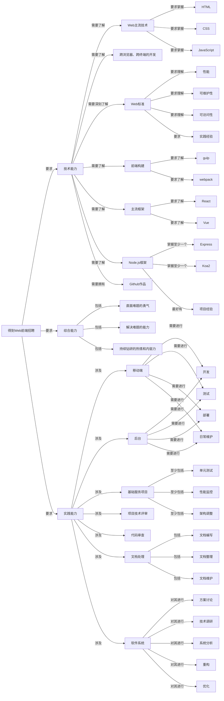

# 得到Web前端求职方案

在这一部分，我将得到的招聘方案，用自己的话重述了一遍，并用流程图表示了出来。同时，根据自己的流程图，设计了自己需要执行的各个阶段。

## 一、得到招聘条件

根据BOSS直聘上的求职信息，招聘条件如下（含重点高亮）：

> 岗位职责：
> 1. 负责得到APP相关==移动端及后台==等相关==开发==、==测试==、==部署==及==日常维护==；
> 2. 负责持续优化==基础服务项目==，包括但不限于==单元测试==，==性能监控==以及==架构调整==；
> 3. 参与==项目技术评审==及 ==Code Review==；
> 4. 相关==文档编写、整理和维护==；
> 5. 参与==软件系统==的==方案讨论==、==技术调研==、==系统分析==、==重构==、==优化==。
> 
> 岗位要求：
> 1. 熟练掌握==主流 Web 前端技术==（HTML/CSS/Javascript等）和==跨浏览器、跨终端的开发==；
> 2. 深刻理解==Web标准==，对==前端性能==、==可访问性==、==可维护性==等相关知识==有实际的了解和实践经验==；
> 3. 对==前端构建==有一定了解（如：==gulp/webpack==等）；
> 4. 热爱前端，对新鲜事物充满好奇心，能==折腾捣鼓==各种互联网==新鲜框架==（如：React/Vue等）；
> 5. 熟悉==Node.js==，并==应用至少一种框架==（如：==Express/Koa2==等），并==有项目经验者优先==；
> 6. 在博客或==Github上有技术沉淀==者优先。
> 
> 我们要什么样的人？
> 1. 有学习能力和自我驱动力
> 2. 愿意挑战自己，跟团队一起成长
> 3. 乐于研究，想成为专业内的大神！

## 二、重新描述招聘条件，并可视化

经过我的拆解后，招聘要求如下：

P.S. 中间的推导过程，放在了编程日记中。

## 三、执行方案

根据Strat From What I Know原则，自己应当先从熟悉的部分开始完成。所以，我按照对于招聘要求的熟悉程度，划分为了三个阶段。

### 第一阶段

这一阶段是我已经掌握的，以复习和证明为主。

1. 综合能力
	- 通过日记记录的形式，说明自己今天：
		- 体现了直面困难的勇气
		- 解决困难的能力
		- 持续前进的热情和内驱力；
2. 技术能力
	- 复习以下技能：
		- HTML
		- CSS
		- JavaScript
	- 同时保持以下能力：
		- 在Github上上传自己的学习进度，做出自己的技术沉淀
3. 实践能力
	- 暂时没有会的。

### 第二阶段

这一阶段的内容，有部分了解，还需要更加深入的学习和应用。

1. 技术能力
	- 了解Web标准
		- 理解其中关于性能、可维护性、可访问性的标准
		- 拥有能够体现自身理解的实践经验
	- 了解如何进行跨浏览器、跨终端的开发
	- 了解主流框架VUE
	- 完善对于React的理解
2. 实践能力
	- 了解代码审查
	- 了解文档处理（Operation: 也许我在Github上所进行的文档编写，就能够体现出这一点）

### 第三阶段

这一阶段，是我完全没有听说过的概念，后续需要进一步的拆分和学习。

1. 技术能力
	- 学习前端构建，包括：
		- Gulp
		- Webpack
	- 学习Node.js
		- 掌握基本概念
		- 学习框架：
			- Express 或者 Koa2
			- 最好做出来一个项目
2. 实践能力
	- 理解基础服务项目，学会相关的优化方式，比如：
		- 单元测试
		- 性能监控
		- 架构调整
	- 了解项目技术评审
	- 了解软件系统的相关流程，包括：
		- 方案讨论
		- 技术调研
		- 系统分析
		- 重构
		- 优化
	- 了解移动端和后台的概念，以及和它相关的事项，包括：
		- 开发
		- 部署
		- 测试
		- 日常维护