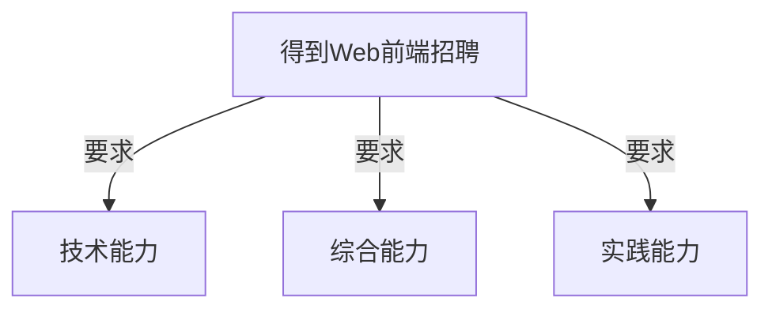
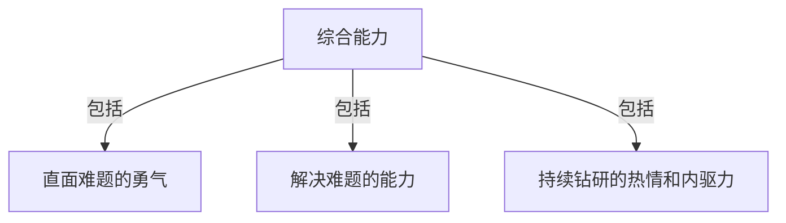
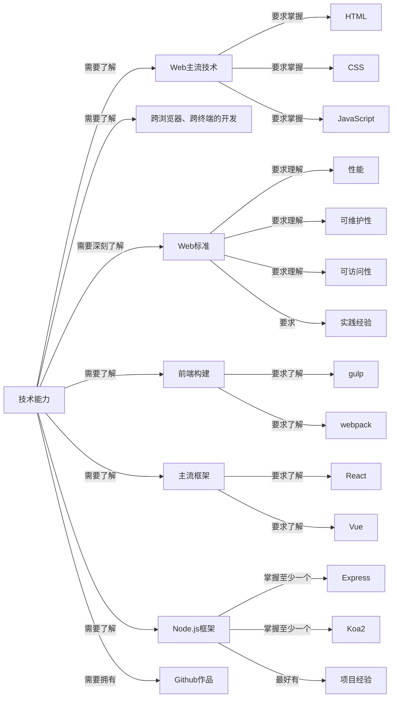
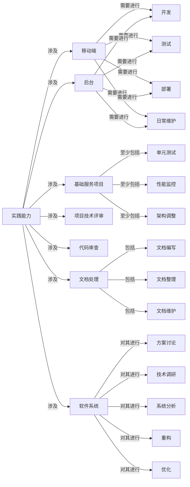
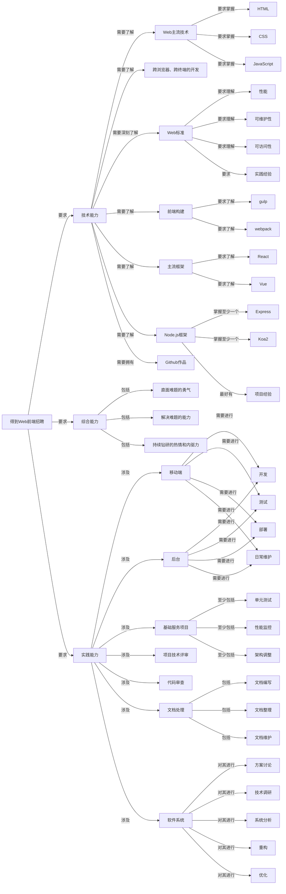

### 2021-12-12编程日记

今天是我落实成为得到Web前端工程师的第一天，今天我将自己未来的努力方向，分成了三个部分：对于前进路径的规划、对于技术水平的提升和证明、以及自己综合水平的成长和证明。

#### 总方案思考过程

我将思考出总方案的过程，放在以下部分：

招聘条件一共分成三个部分，如果用我自己的话来说，就是：你在业务上要做的事、你在业务能力上需要达到的条件、你的软性能力要求。

那么，在这三个部分中，我认为业务能力>软性能力>对于业务流程的熟悉程度。因为，业务能力强的人，本身知识背景就丰富，学习起业务来也会相对更快一些；而如果软性能力好、学习能力强，那么能够进一步加快对于业务流程的学习。

所以，对于得到的招聘要求，我在第一层拆分成了：

然后就是对每一层的细分。

我们先从自己最熟悉的部分，也就是对通用能力的要求，进行细分。

在这一部分，我们需要有：学习能力、自驱力、自我挑战的勇气、深入钻研的热情。

其实，某种程度上说，这些能力是符合某一串逻辑的：我们因为勇气，而敢于直面困难的问题；然后，我们利用学习能力，将困难解决，从而获得成就感，以及进一步钻研的动力；在这样持续的正反馈中，我们拥有了持续钻研的热情，并最终形成了稳定的自驱力。

也就是说，勇气让我们敢于直面问题，学习能力让我们能够解决问题。在这种正反馈下，我们逐渐拥有了钻研的热情，以及自我成长的自驱力。

用流程图总结一下，就是：

这一块是你的强项，但考察的机会一般会放在HR面当中，技术面更多考虑的是你的理论水平（业务能力）以及对业务流程的熟悉程度（实操能力）。

接下来，我打算从对于技术能力的要求开始，逐步解构。

首先，Web的主流技术需要掌握，包括HTML/CSS/JavaScript等；
同时，还需要了解跨浏览器、跨终端的开发；
然后，还需要了解Web标准，并对标准中“性能”、“可维护性”、“可访问性”这三点，需要有一定的理解和实践经验；
接下来，需要了解前端的构建，比如：gulp/webpack；
接着，还需要了解一些主流框架，比如：React/Vue；
而且，还需要了解Node.js，以及它的至少一种框架，比如：Express/Koa2，相关的项目经验可以作为加分项；
最后，在Github上有自己作品的，可以作为加分项；

可以看到，一共拆分成了七点，如果用流程图表示的话，应当是：

到这一步，技术上面的要求就拆解地比较详细了。当然，其中也依然涉及到了很多你不了解的知识，没关系，虽然这些内容无法仅结合招聘条件就进行拆解，但是你可以通过自己的操作，来进一步寻求解决方案。

接下来是对岗位职责的重述，还是先从语言描述开始。

先把得到对于Web前端的岗位职责放在这里：

岗位职责：
1. 负责得到APP相关==移动端及后台==等相关==开发==、==测试==、==部署==及==日常维护==；
2. 负责持续优化==基础服务项目==，包括但不限于==单元测试==，==性能监控==以及==架构调整==；
3. 参与==项目技术评审==及 ==Code Review==；
4. 相关==文档编写、整理和维护==；
5. 参与==软件系统==的==方案讨论==、==技术调研==、==系统分析==、==重构==、==优化==。

如果分条列点地拆解一下，应当是：

首先，是对于移动端和后台的开发、测试、部署和日常维护；
然后，是对基础服务项目的持续优化，比如：单元测试、性能健康、架构调整等。
接着，还需要参与项目技术评审，以及代码审查。
还有，需要参与文档的编写、整理和维护。
最后，需要参与软件系统的方案讨论、技术调研、系统分析、重构、优化等。

如果用流程图表示，应当为：

那么，如果把之前的可视化重述整理在一起的话，应当是下面这样：

在后续的推进中，如果完成了其中一个节点，就改变其背景颜色。

可以查看这个流程图的[在线版](https://rb.gy/x2qcjy)（Visit with ladder）

