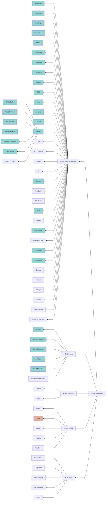

# 编程日记

今天打算学习HTML。

接下来，打算先确定一下要在什么平台上学习HTML的哪些内容，然后开始今天的学习。在学习的过程中，要进行代码的练习，并将知识体系化地记录下来。

## 确定HTML的学习范围

Google上搜索了一下HTML，发现排名前三的平台是：W3Schools, 维基百科以及html.com。

我打算从自己最熟悉的平台：W3School入手。

这个平台，将HTML的知识划分为了五个部分：基础知识、表格、图形、媒体、API，最后附带知识索引的部分。

我打算浏览一遍基础知识，并了解剩余的四个部分大致说了哪些HTML的功能，但不去研究具体的原理部分。之后，再将我所学到的内容，成体系地记录下来。

## 配置VSCode的HTML环境

接下来，我打算在VSCode上编译和运行HTML。但是，按照传统的方法编辑和加载HTML的话，会有一些麻烦，于是我决定先寻找几个好用的HTML插件，来优化一下使用体验。

在刚刚的十分钟里，我尝试了3个不错的插件：

第一个是：Live Server，能够自动打开浏览器，并且保存代码以后就能够自动更新；
第二个是：Auto Rename Tag，这个插件能让我在编辑起始标签的时候，就自动更新结束标签；
第三个是：Pretier - Code Formatter，这个插件能够让我在保存代码的时候，就优化代码格式，从而始终保持良好的代码风格。

## 学习HTML基础知识

基础知识分成很多部分，学完大概需要将时间分成好几个块。我打算每在一个时间块中学完知识，都将自己的所得记录在这里。

### 第一个时间块

在第一个时间块中，我一共学习了以下部分：元素、属性、标题、段落、\<style>以及文本格式化（formatting）。

其中：

- 元素就是起始标签+内容+结束标签，但对于空元素（empty tag）而言，只有起始标签；
- 属性，往往以名字/值对（name/value pairs）的形式出现，值的部分往往需要用双引号括起；
- 标题、段落很熟悉了，跳过；
- \<style>标签，能够在HTML文档中内嵌一些格式，比如：backgrond-color, text-align等；
- 文本格式化，能够将文本以各种形式加以处理，包括下标（sub）、上标（sup）、加粗（strong/bold）、高亮（mark）、诗歌格式（pre）、斜体（i）、强调（em）等，具体可以查看[该链接](https://www.w3schools.com/html/html_formatting.asp)。

### 第二个时间块

在第二个时间块中，我学习了如下内容：引用（Quotations）、评论、颜色、CSS、链接、图片、网页图标（Favicon）、表格。

其中，我精读学习的内容是：

- 链接（link），可以有三个属性，分别是：href，target，以及title.
	- target一般有两个值，一个是默认值_self，另一个是_blank。前者会在自身标签页下跳转，后者会在新的标签页下跳转。
	- title会让鼠标悬停在链接上时，产生注释框。
- 网页图标，favicon是favorite和icon的缩写；
- 表格，我学习了只显示一条表格线的方法：`border-collapse: collapse;`，还可以通过height来调整表格高度；

## 设计HTML的学习进度条

以上的内容，一共花费了我1h50min的时间，但是学习效率却低于我的想象。这也导致我有一些焦虑和丧气。为了解决这个问题，我打算继续拆解HTML的学习内容，好让我把握自身的学习进度。

首先，我需要确定一下，我学习HTML的目的是什么？是为了能够掌握好大致的基础，同时要了解，假如碰到了一些不熟悉的功能，可以去哪里寻找。

那么，我可以先将W3Schools的知识体系罗列出来，然后根据自己的需要，从中挑选需要学习的内容。

关于HTML的知识体系，我绘制了如下的流程图（在线版：shorturl.at/myUV5）：

P.S. 上图中，蓝色为已完成的内容，棕色为值得完成的内容。

我花费了大约1h20min的时间，浏览了全部的内容，在脑海中形成了对于每一个知识点的大致理解。同时，我还标注了值得精读的部分，这些部分最好用代码展示出来自己有理解和应用过。

具体的学习，我打算等到明天再做。