# 2021-12-20 编程日记

今天，把HTML复习一遍，做出HTML的总体练习，来证明自己会使用HTML。然后，再学习CSS，将CSS的所有内容的路径图罗列出来。

## 完成HTML综合练习

今天花费了大约一下午的时间，完成了HTML的综合练习。说实话，当我再去做几天前的练习时，自己已经忘记了一部分了。

所以，感觉做出来一份HTML知识点自查表，还是一件很重要的事。

另外，在完成综合练习的过程中，明显感觉到有一点点的吃力。虽然都是我做过的练习，但是综合在一起以后，就会有一些思路更不上。

好在，当我做到表单的时候，及时转变思路，开始为这一部分写下计划，即：先写好最外层的元素，构建起整个练习的框架，然后再往每个元素中间，添加新的元素，补充细节。

接下来，可以尝试把学习HTML的过程中，所习得的学习方法，和知识点，做成CheetSheet，帮助你巩固和复盘知识。

## HTML备忘清单

在复习HTML的过程中，除了巩固以前学过的知识，同时也会摄入一些新的知识，并尝试运用各种方法，解决一些问题。

为了以后能够更好地调用这些知识和方法，我做了一份备忘清单，方便日后回忆。

### HTML知识点

HTML的知识点，我不打算系统性地整理，因为网上有很多这样的资料。我要做的，是将我不熟悉的标签放在这里，并简单解释一下。

1. pre，文本格式不变；
2. caption，表格标题；
3. rowspan，单元格跨行；
4. 多链接居中：`parent-element{display: inline-block; text-align: center;}`
5. fieldset，表单字段组，将所有元素组合在一起；
6. legend，表单字段组的标题；
7. datalist，选项列表，和input组合使用，例如：
	```html
	<input list='id'>
	<datalist id='id'></datalist>
	```
8. action，表格元素form的属性，其值是表单内容所要传送给的网址/文件。

### HTML学习方法

在学习HTML的过程中，我尝试了很多新方法。

1. 始终有计划

	HTML算是前端知识中，最简单的部分。所以在复习的时候，我想要一口气复习完。但是，总有一些知识点是已经遗忘、或者新遇见的，所以推进的速度并没有想象中快，结果导致有点泄气。
	
	但是，我尝试先纵览一遍HTML的所有知识，了解到所有的板块大致在讲什么内容以后，将这些知识做成知识导图，并标识其中值得学习的部分。
	
	这样一来，我所需要学习的知识直接减少到原先的1/3，并且，由于有了整个路径，自己可以一边学习，一边标注，这样就相当于有了学习的进度条，学习的每一步都有了明确的方向和反馈。
	
2. 给自己出题

	以前学习HTML所做的练习，主要是别人已经写好的。但是，这些题目只是单纯地帮助我掌握知识，无法带来成就感。
	
	但是，当我尝试按照自己的思路，将所学的知识点运用起来以后，我发现，自己会利用所学，去表达自己想要表达的内容。当我能够用新的方式表达自己的想法以后，便会带来很强的成就感。
	
	在这种成就感的推动下，我会将自己已经做出来的练习，再进行优化，从而得到令自己更加满意的作品，并进一步获得成就感，走向正循环。
	
3. 记录每一个思考

	在运用前端知识表达自己想法的过程中，一定会遇到不会的题目。而在这个过程中，也一定会有一些没有达到理想效果的、失败的尝试。
	
	但是，我不会将这些失败的尝试直接丢弃，而是依然将其记录下来，去说明为什么它不行。而错误本身也是有价值的，它能够帮助你排除错误答案、帮助你对这个用错的概念了解地更加深刻。
	
	所以，当我回过头去审视自己的错误代码时，也依然能从中看到自己的进步，并获得一种成就感。

## CSS总体路径设计

终于来到了CSS，刚刚我大致浏览了一遍知识点，发现其中有非常多有趣的部分，可以激发我很多的灵感。

感觉从这一阶段以后，我就可以设计出一些非常漂亮的网页了。同时，我也可以借助一些CSS框架以及CSS插件，来帮助我快速地设计出一些具有独特风格的网页，并帮助我减少冗余的操作。

首先，我打算先把整体的路径图给画出来，然后再去标注其中有价值的地方。

```mermaid
flowchart RL
	CSS ---> Tutorial & Advanced & Responsive & Grid & SASS
	Tutorial ---> Syntax & Selectors & a[How to] & Comments & Colors & Backgrounds & Borders & Margins & Padding & Height/Width & b[Box Model] & Outline & Text & Fonts & Icons & Links & Lists & Tables & Display & Max-width & Position & Z-index & Overflow & Float & Inline-block & Align & Combinators & a1[Pseudo-class] & Pseudo-element & Opacity & c[Navigation Bar] & Dropdowns & d[Image Gallery] & e[Image Sprites] & f[Attr Selector] & Forms & Counters & g[Website Layout] & Units & Specificity & !important & h[Math Functions]
	Advanced ---> 1[Rounded Corners] & 2[Border Images] & 3[Backgrounds] & 4[Colors] & 5[Color Keywords] & Gradiants & Shadows & 6[Text Effects] & 7[Web Fonts] & 8[2D Transforms] & 9[3D Transforms] & Transitions & Animations & Tooltips & 10[Style Images] & 11[Image Reflection] & object-fit & object-position & Masking & Buttons & Pagination & 12[Multipul Columns] & 13[User Interface] & Variables & 14[Box Sizing] & 15[Media Queries] & 16[MQ Examples] & Flexbox
	Responsive ---> 1g[Intro] & Viewport & 1a[Grid View] & 1b[Media Queries] & 1c[Images] & 1d[Vedios] & 1e[Framworks] & 1f[Templetes]
	Grid ---> 2a[Intro] & 2b[Container] & 2c[Item]
	SASS ---> 3a[Tutorial]
```



不过，由于今晚已经学地有点疲倦了，所以打算先罗列好知识纲要，然后等到明天再去标注有价值的地方（感觉这次的CSS大部分都会成为有价值的地方）